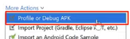
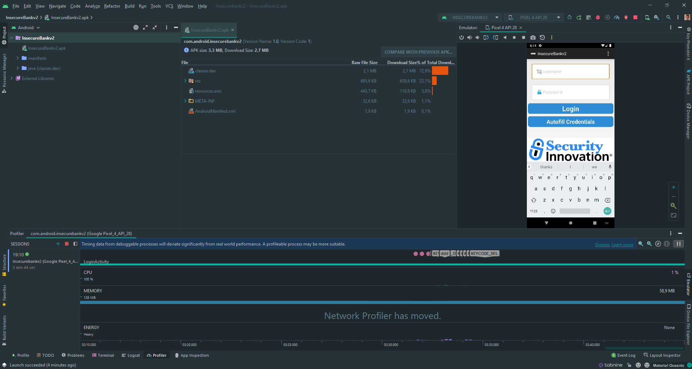
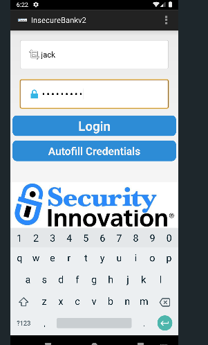
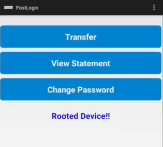
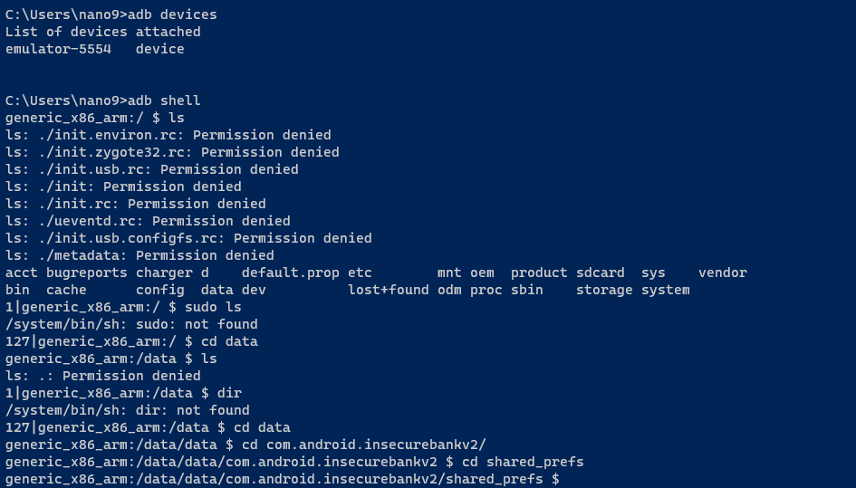
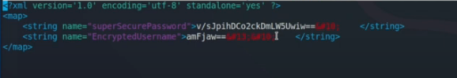
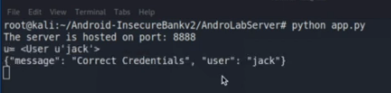
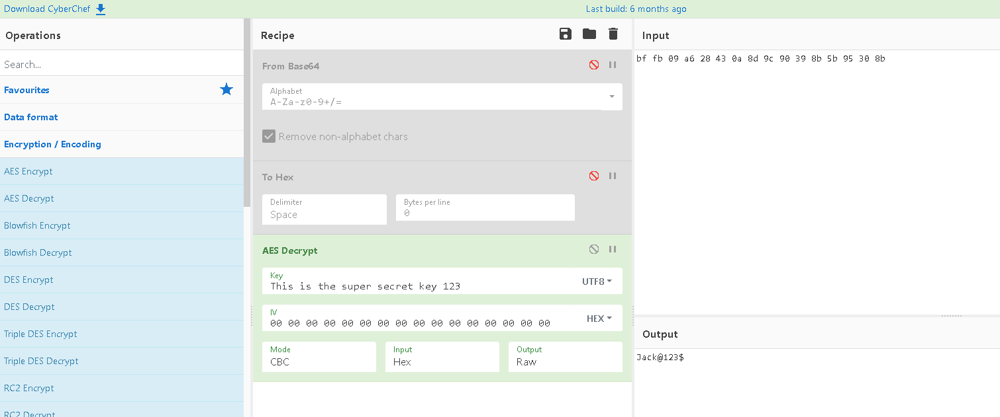
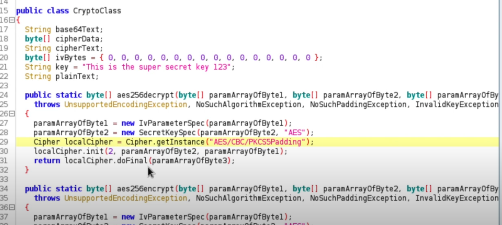

# Android-ConfidentalDataCibersecurity

Android Confidential Data analysis for ethical security.

## PASOS

1. Hacemos un profile de la APK con Android Studio.

2. Iniciamos la app en modo monitor con el botón específico para ello (véase la documentación oficial para desarrolladores de Android).

3. Iniciamos sesión con las credenciales por defecto (user: jack, password: Jack@123$).

4. Hemos iniciado sesión.

5. Usamos adb (la interfaz de debuggeo de Android) para ver los dispositivos contectados y entrar a su sistema de ficheros.

6. Recuperamos las preferences con los datos de inicio de sesión con `adb pull data/data/com.android.insecurebankv2/shared_prefs/mySharedPreferences.xml`.

7. Vemos los datos de inicio de sesión en shared_prefs.

8. Antes de iniciar sesión, tenemos que arrancar el servidor de la app. Así recuperaremos los datos al iniciar sesión desde la consola.

9. Desciframos los datos con ayuda del código fuente de la aplicación (aquí desciframos la contraseña con AES, ya que el nombre de usuario está codificado en Base64).

* Este es el código fuente de la aplicación donde se hace login y se encripta los datos.

