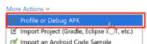

# Android-ConfidentalDataCibersecurity

Android Confidential Data analysis for ethical security.

## PASOS

1. Hacemos un profile de la APK con Android Studio.

2. Arrancamos la app con el modo monitor usando el botón especifico para ellos (véase la documentación oficial de Developer Android).

3. Nos logeamos con las credenciales por defecto (user: jack, password: Jack@123$).

4. Nos hemos logeado.

5. Usamos adb (la interfaz de debuggeo de Android) para ver los dispositivos contectados y entrar a su sistema de ficheros.

6. Recuperamos las preferences con los datos de inicio de sesión con `adb pull data/data/com.android.insecurebankv2/shared_prefs/mySharedPreferences.xml`.

7. Vemos los datos de inicio de sesión en las shared_prefs.

8. Antes de logearnos tenemos que arrancar el servidor de la app y recuperaremos así los datos al logearnos por consola.

9. Desencriptamos los datos con la ayuda del codigo fuente de la aplicación (aquí desencriptamos la contraseña con AES, ya que el usuario está en Base64).

* Este es el código fuente de la aplicación donde se hace login y se encripta los datos.

